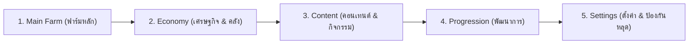

# 💎 Project Barun (PB) — Scripting Architecture Standard

High-performance, low-level Luau exploit architecture & UI framework inspired by the best engineering patterns of 2K Hub.

---

## 🏛️ 1. มาตรฐานการจัดหน้า UI 5 หมวดหมู่หลัก (The 5-Pillar Standard)

เพื่อให้สคริปต์ทุกตัวในโปรเจกต์มีระเบียบ สะอาด และผู้เล่นเข้าใจได้ทันที ให้ยึดโครงสร้าง 5 หมวดหมู่นี้เป็นมาตรฐานสากลเสมอ:



| ลำดับแท็บ | ชื่อแท็บ | ความรับผิดชอบ / องค์ประกอบภายใน |
| :---: | :--- | :--- |
| **1** | **Main Farm (ฟาร์มหลัก)** | • Live Telemetry StatCards (สถิติสด FPS/Ping/Rolls)<br>• Loop ฟาร์มหลักที่ผู้เล่นเปิดบ่อยสุด (Auto Roll, Auto Mine, Auto Fish)<br>• ระบบเกาะ/พื้นที่ฟาร์มหลัก (Plot Balance) |
| **2** | **Economy (เศรษฐกิจ & คลัง)** | • Auto Sell (ขายของ/ปลา/ยูนิตอัตโนมัติ)<br>• กฎความปลอดภัยป้องกันของหาย (Protect Plotted, Team, Locked, High-Grade)<br>• Smart Potions / Buffs (ระบบกดยาน้ำและบัฟ) |
| **3** | **Content (คอนเทนต์ & กิจกรรม)** | • ดันเจี้ยนประจำเกม (Towers, Bosses, Raids)<br>• มินิเกมและการปรับแต่งตัวละคร (Grade Reroll, Fusion, Enchant) |
| **4** | **Progression (พัฒนาการ)** | • Auto Rebirth (จุติอัตโนมัติพร้อมเงื่อนไขเงินพอ)<br>• Skill Tree Upgrades (ซื้ออัปเกรดต้นไม้ทักษะเรียงลำดับความสำคัญ)<br>• Gear / Dice / Pickaxe Shop (ซื้ออุปกรณ์ขั้นต่อไปเมื่อเงินถึง) |
| **5** | **Settings (ผู้เล่น & ตั้งค่า)** | • Triple-Layer Anti-AFK (ป้องกันหลุด 24 ชม. 100%)<br>• Free Rewards (รับ Daily, Offline, Spin อัตโนมัติ)<br>• Map Teleports (จุดวาร์ปสำคัญ)<br>• Performance (Boost FPS 120, Fullbright)<br>• Script Controls (Unload Hub) |

---

## 📐 2. กฎการเรียง Element ในแต่ละ Section (Section Stacking Law)

ภายในแต่ละ Section ห้ามวางปุ่มกระจัดกระจาย ให้เรียงตามลำดับความสำคัญ 3 ชั้นเสมอ:

```
┌─────────────────────────────────────────────────────────────┐
│ ✦ Section Name                                              │
├─────────────────────────────────────────────────────────────┤
│ 1. [Toggle] Master Switch (สวิตช์เปิด/ปิดระบบหลัก)             │
│       │                                                     │
│ 2. [Slider / Dropdown] Fine-Tuning (ตัวปรับแต่งค่าละเอียด)      │
│       │                                                     │
│ 3. [Button] One-Shot Test Action (ปุ่มกดทดสอบทำงาน 1 ครั้ง)    │
└─────────────────────────────────────────────────────────────┘
```

* **ชั้นที่ 1 (บนสุด):** สวิตช์หลัก `Toggle` เช่น "เปิดระบบขุดแร่", "เปิดระบบขายตัวละคร"
* **ชั้นที่ 2 (ตรงกลาง):** ตัวปรับแต่งค่า `Slider`, `Dropdown`, `Textbox` เช่น ดีเลย์, ชั้นเป้าหมาย, เกรดที่ต้องการ
* **ชั้นที่ 3 (ล่างสุด):** ปุ่มกดกระทำทันที `Button` สำหรับทดสอบหรือกดแบบแมนนวล เช่น "ทดลองทอย 1 ครั้ง", "ขายตัวทันที", "รับของขวัญทันที"

---

## ⚡ 3. ตัวโหลดสคริปต์สากล (Loadstrings)

### Anime Dice:
```lua
loadstring(game:HttpGet("https://raw.githubusercontent.com/Barun080/Project-Barun/main/load_anime_dice.lua"))()
```

### Ghost Driver:
```lua
loadstring(game:HttpGet("https://raw.githubusercontent.com/Barun080/Project-Barun/main/load_ghost_driver.lua"))()
```

### Core Architecture Engine:
```lua
local Core = loadstring(game:HttpGet("https://raw.githubusercontent.com/Barun080/Project-Barun/main/enterprise_core.luau"))()
```